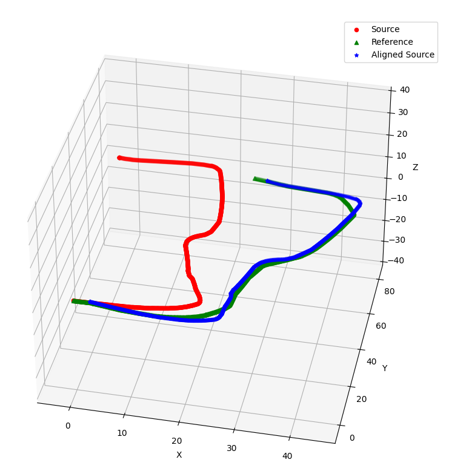

# Umeyama icp alignment

You don't need to consider timestamp sinc between two trajectory  
txt file format : TUM (timestamp x y z qx qy qz qw)  


# Run  
```
python3 Umeyama_icp_alignment.py --src [YOUR_SRC].txt  --ref [YOUR_REF].txt
```

# Result
Save : modifed_[YOUR_SRC].txt  
